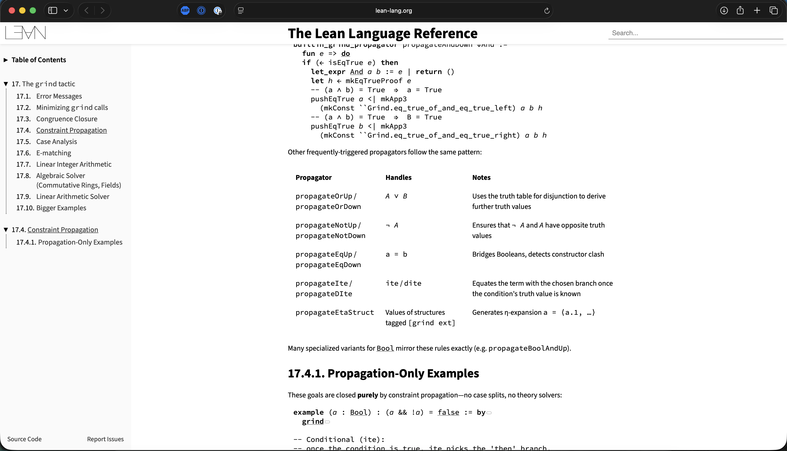
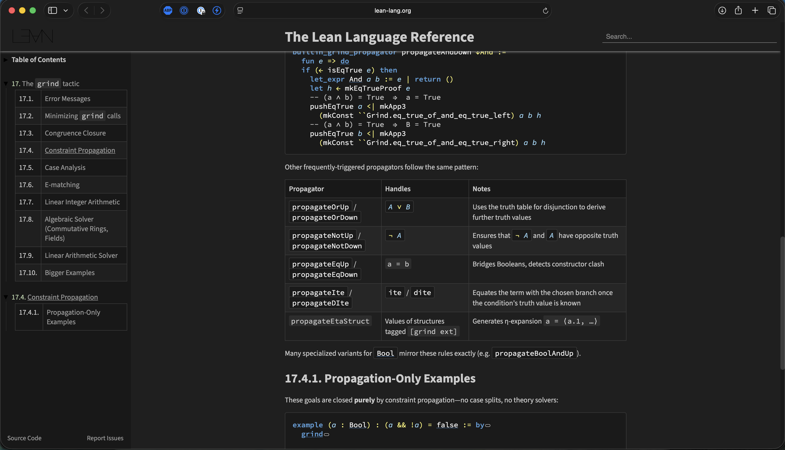

# Lean Docs Highlighter

A Safari Web Extension that adds dark mode and syntax highlighting to the [Lean 4 language reference documentation](https://lean-lang.org/doc/reference/latest/).

| Without Extension | With Extension |
|-------------------|----------------|
|  |  |

## Features

- **Dark theme** based on VS Code Dark Modern
- **Syntax highlighting** using semantic token classes from Verso/SubVerso
- Styled code blocks, tactic states, tooltips, and documentation

### Syntax Colors

| Token Type | Color |
|------------|-------|
| Keywords | Blue `#569cd6` |
| Types/Sorts | Teal `#4ec9b0` |
| Variables | Light Blue `#9cdcfe` |
| Strings | Orange `#ce9178` |
| Numbers | Light Green `#b5cea8` |
| Comments | Green `#6a9955` |
| Operators | Yellow `#fff873` |

## Installation

### Prerequisites

- macOS with Xcode
- Safari 14+

### Setup

1. Clone this repository

2. Open `Lean Docs Highlighter/Lean Docs Highlighter.xcodeproj` in Xcode

3. Configure signing:
   - Select the project in the navigator
   - For both macOS targets, go to Signing & Capabilities
   - Select your Personal Team
   - Choose "Development" certificate

4. Build: `Cmd+R` or run `./build.sh` from the `Lean Docs Highlighter` directory

5. Enable in Safari:
   - Safari > Settings > Extensions
   - Check "Lean Docs Highlighter"
   - Grant permission for `lean-lang.org`

## Usage

Once enabled, the dark theme with syntax highlighting will be applied automatically on:

- https://lean-lang.org/doc/reference/
- https://lean-lang.org/theorem_proving_in_lean4/
- https://lean-lang.org/functional_programming_in_lean/

### Development Workflow

Edit `Shared (Extension)/Resources/content.css`, then rebuild:

```bash
cd "Lean Docs Highlighter"
./build.sh
```

The build script compiles the extension and opens a test page in Safari.

If using VS Code with the Code Runner extension, right-click `build.sh` > "Run Code".

## Project Structure

```
Lean Docs Highlighter/
├── build.sh                           # Build and test script
├── Lean Docs Highlighter.xcodeproj/   # Xcode project
├── Shared (Extension)/
│   └── Resources/
│       ├── content.css                # Dark theme + syntax highlighting
│       ├── manifest.json              # Extension configuration
│       └── images/                    # Extension icons
├── Shared (App)/                      # Container app resources
└── macOS (App|Extension)/             # macOS-specific files
```

## How It Works

The Lean reference manual is built with [Verso](https://github.com/leanprover/verso), which uses [SubVerso](https://github.com/leanprover/subverso) for syntax highlighting. SubVerso outputs semantic CSS classes on code tokens:

- `.keyword` - Language keywords
- `.const` - Constants and constructors
- `.var` - Variables
- `.sort` - Sorts (Type, Prop)
- `.literal` - Literals
- `.comment` - Comments
- `.unknown` - Operators and punctuation

These classes exist in the production HTML but have minimal styling. This extension injects CSS that applies dark backgrounds and syntax colors to these existing semantic classes.

## Customization

All colors are defined as CSS variables at the top of `content.css`:

```css
:root {
  --bg-primary: #1f1f1f;
  --syn-keyword: #569cd6;
  --syn-const: #4ec9b0;
  /* ... */
}
```

Edit these values and rebuild to customize the theme.

## License

apache 2.0
