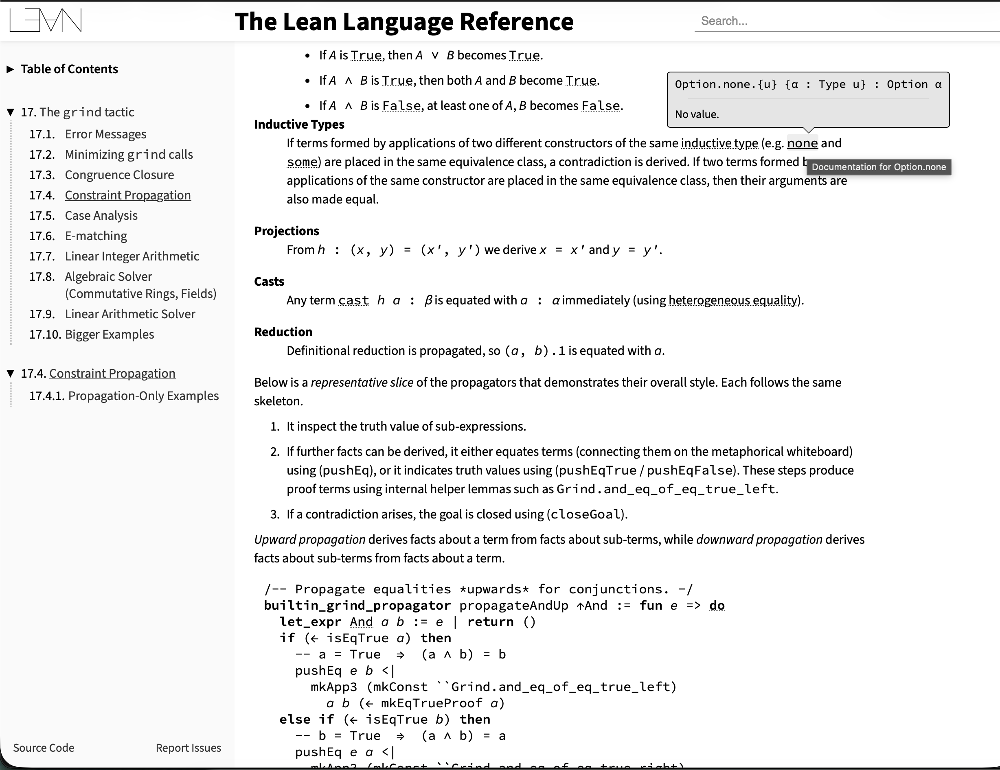
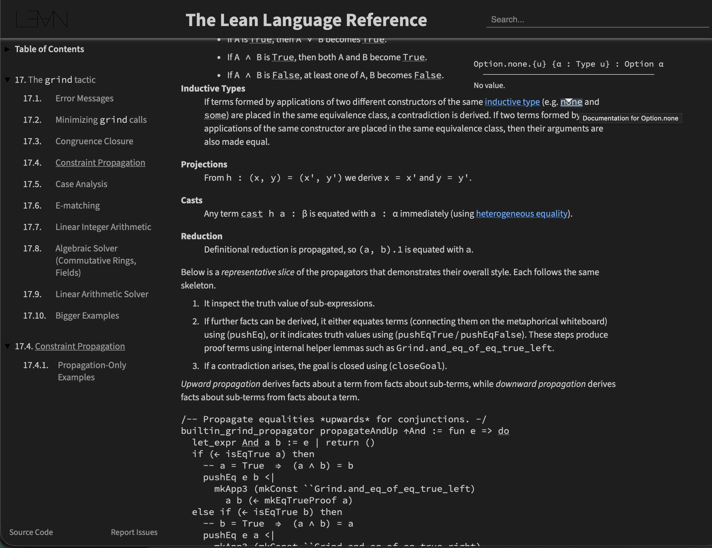
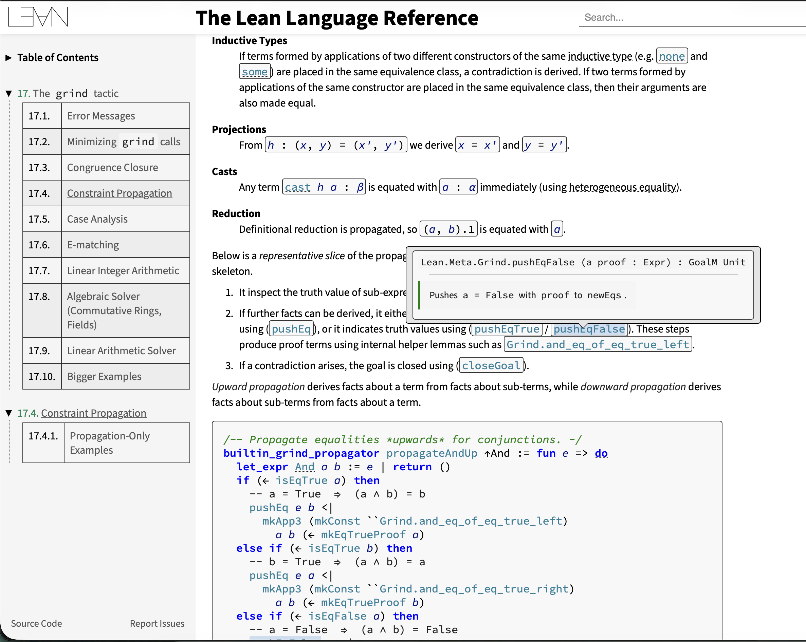
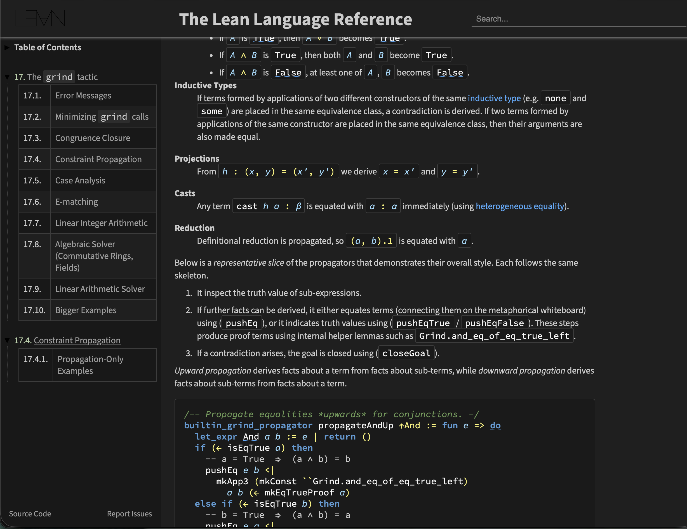

# Lean Docs Highlighter

A Safari Web Extension that adds theme options and syntax highlighting to the [Lean 4 language reference documentation](https://lean-lang.org/doc/reference/latest/).

|  | Light | Dark |
|--|-------|------|
| **Regular** |  |  |
| **+ Syntax** |  |  |

## Features

- **4 Theme Modes** accessible via toolbar popup:
  - **Light** - Original site appearance
  - **Light + Syntax** - Original background with syntax highlighting and styled code blocks
  - **Dark** - Inverted colors, minimal styling
  - **Dark + Syntax** - VS Code Dark Modern theme with full styling (default)
- **Syntax highlighting** using semantic token classes from Verso/SubVerso
- Styled code blocks, tactic states, tooltips, and documentation

### Syntax Colors (Dark + Syntax)

| Token Type | Color |
|------------|-------|
| Keywords | Blue `#569cd6` |
| Types/Sorts | Teal `#4ec9b0` |
| Variables | Light Blue `#9cdcfe` |
| Strings | Orange `#ce9178` |
| Numbers | Light Green `#b5cea8` |
| Comments | Green `#6a9955` |
| Operators | Yellow `#fff873` |

## Installation

### Prerequisites

- macOS with Xcode
- Safari 14+

### Setup

1. Clone this repository

2. Open `Lean Docs Highlighter/Lean Docs Highlighter.xcodeproj` in Xcode

3. Configure signing:
   - Select the project in the navigator
   - For both macOS targets, go to Signing & Capabilities
   - Select your Personal Team
   - Choose "Development" certificate

4. Build: `Cmd+R` or run `./build.sh` from the `Lean Docs Highlighter` directory

5. Enable in Safari:
   - Safari > Settings > Extensions
   - Check "Lean Docs Highlighter"
   - Grant permission for `lean-lang.org`

## Usage

Once enabled, click the extension icon in Safari's toolbar to select a theme mode. The extension works on:

- https://lean-lang.org/doc/reference/
- https://lean-lang.org/theorem_proving_in_lean4/
- https://lean-lang.org/functional_programming_in_lean/
- https://leanprover.github.io/reference-manual/

### Theme Modes

| Mode | Background | Code Style | Use Case |
|------|------------|------------|----------|
| Light | Original | Monochrome | Reading in bright environments |
| Light + Syntax | Original | Colored with borders | Syntax awareness on light background |
| Dark | Inverted | Monochrome | Eye comfort, minimal styling |
| Dark + Syntax | VS Code Dark | Colored with borders | Full IDE-like experience (default) |

Theme selection resets on page reload (no persistence).

### Development Workflow

Edit `Shared (Extension)/Resources/content.css`, then rebuild:

```bash
cd "Lean Docs Highlighter"
./build.sh
```

The build script compiles the extension and opens a test page in Safari.

If using VS Code with the Code Runner extension, right-click `build.sh` > "Run Code".

## Project Structure

```
Lean Docs Highlighter/
├── build.sh                           # Build and test script
├── Lean Docs Highlighter.xcodeproj/   # Xcode project
├── Shared (Extension)/
│   └── Resources/
│       ├── content.css                # Theme styles + syntax highlighting
│       ├── content.js                 # Theme application logic
│       ├── popup.html/css/js          # Theme selector UI
│       ├── manifest.json              # Extension configuration
│       └── images/                    # Extension icons
├── Shared (App)/                      # Container app resources
└── macOS (App|Extension)/             # macOS-specific files
```

## How It Works

The Lean reference manual is built with [Verso](https://github.com/leanprover/verso), which uses [SubVerso](https://github.com/leanprover/subverso) for syntax highlighting. SubVerso outputs semantic CSS classes on code tokens:

- `.keyword` - Language keywords
- `.const` - Constants and constructors
- `.var` - Variables
- `.sort` - Sorts (Type, Prop)
- `.literal` - Literals
- `.comment` - Comments
- `.unknown` - Operators and punctuation

These classes exist in the production HTML but have minimal styling. This extension injects CSS that applies theme-specific backgrounds and syntax colors to these existing semantic classes. Theme selection is handled via a `data-theme` attribute on the document root.

## Customization

All colors are defined as CSS variables at the top of `content.css`:

```css
:root {
  /* Dark mode */
  --bg-primary: #1f1f1f;
  --syn-keyword: #569cd6;
  --syn-const: #4ec9b0;

  /* Light mode */
  --bg-light-code: #f8f8f8;
  --syn-keyword-light: #0000ff;
  /* ... */
}
```

Edit these values and rebuild to customize the themes.

## License

Apache 2.0
